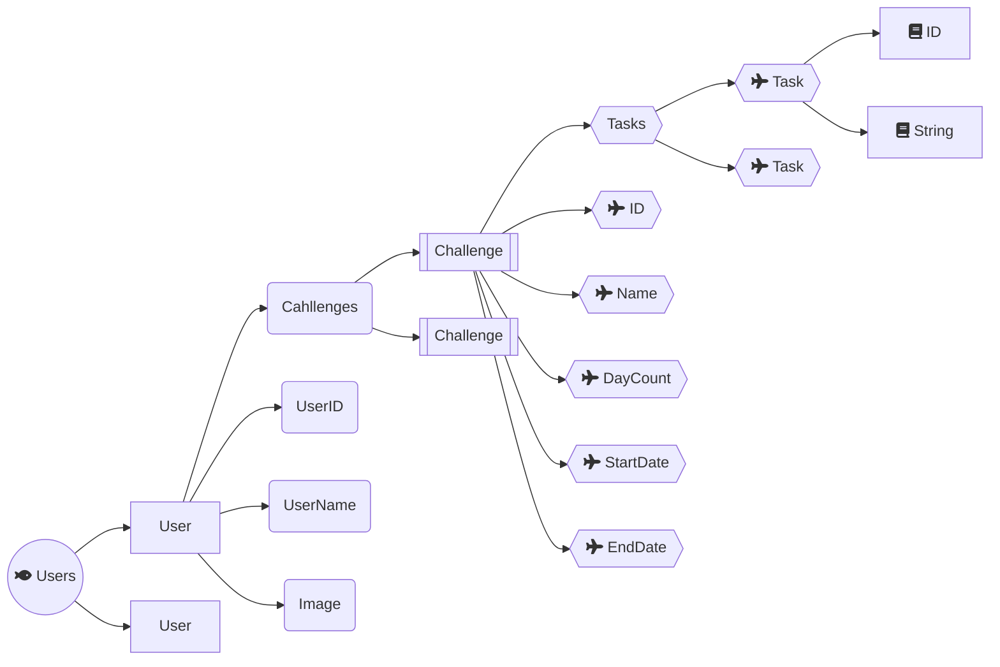

# Challenge
 
### Website [Streak Challenge](codefrydev.in/streak)

```mermaid
flowchart LR
    Array((fa:fa-fish Users)) -->A
    Array-->X[User]
    A[User] -->B(Cahllenges) 
    A -->BID(UserID) 
    A -->BUN(UserName) 
    A -->BUI(Image)  
    B --> T[[Challenge]]
    B --> U[[Challenge]]
    T--> Tl{{Tasks}}
    Tl--> C{{fa:fa-plane Task}}
    Tl--> CC{{fa:fa-plane Task}}  
    T-->CID{{fa:fa-plane ID}} 
    T-->CName{{fa:fa-plane Name}} 
    T-->CDC{{fa:fa-plane DayCount}}
    T-->CSD{{fa:fa-plane StartDate}} 
    T-->CED{{fa:fa-plane EndDate}}  
    C --> DID[fa:fa-book ID]
    C --> D[fa:fa-book String] 
```